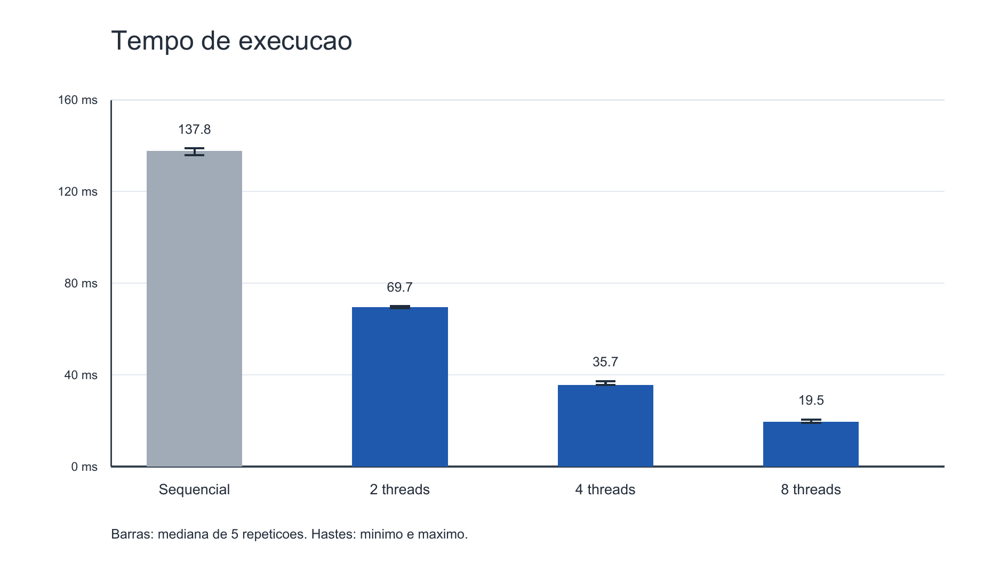
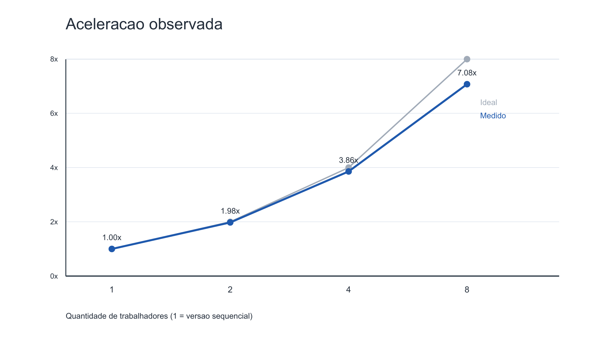
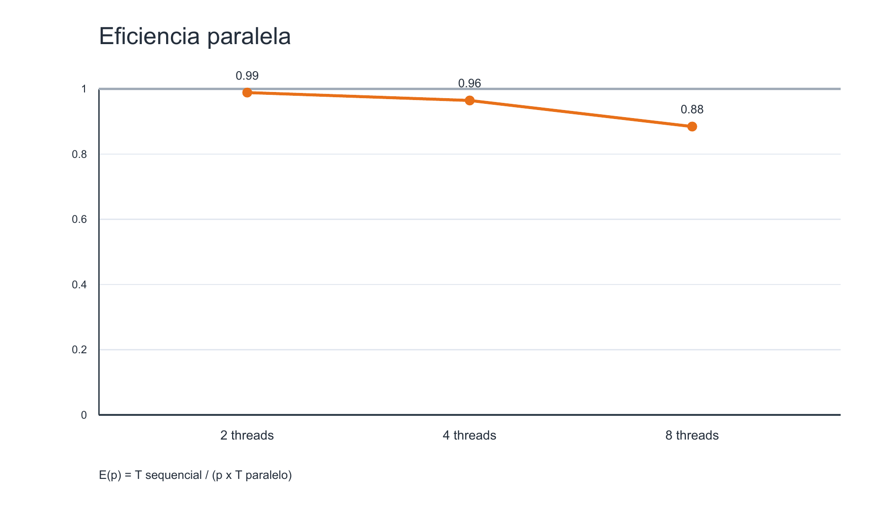

# Relatório técnico — Contagem paralela de objetos em uma matriz binária

> - **Disciplina:** Sistemas Operacionais — 2026/II
> - **Professor:** Prof. Filipo Mór
> - **Instituição:** Pontifícia Universidade Católica do Rio Grande do Sul
> - **Repositório:** https://github.com/guilhermeghise/sisop-t1
> - **Data:** 06/10/2026
> - **Commit de referência da entrega:** `101320f821a00558e31e9048e771860e7931c123`

## Identificação

| Campo | Informação |
|---|---|
| Integrante 1 | Guilherme Ghise — 23200662 |
| Integrante 2 | Eduardo Ferrari — 23280274 |
| Modalidade | Dupla |
| Turma | 330 |
| Estratégia paralela | Pthreads, faixas de linhas |
| Plataforma testada | macOS 27.0.1, arm64 |

## Resumo

O trabalho conta objetos de uma matriz binária usando conectividade 8. Foi
implementada uma versão sequencial de referência e uma versão paralela com
Pthreads, ambas em ANSI C C89/C90. O cálculo local emprega flood fill
iterativo: cada componente recebe um rótulo, sem recursão. Na versão paralela,
as linhas são distribuídas em faixas exclusivas; após a conclusão das threads,
um union-find reúne os componentes conectados através das fronteiras, inclusive
por diagonais. As cinco matrizes obrigatórias produziram as contagens esperadas
nas duas versões. Também foram verificados casos adicionais, 30 matrizes
aleatórias contra uma referência independente e entradas inválidas. Em uma
matriz determinística de 2400 × 2400 células, todas as configurações contaram
176.011 objetos. As medianas de cinco medições foram 137,768 ms na versão
sequencial e 69,665, 35,709 e 19,469 ms com 2, 4 e 8 threads,
respectivamente. A maior aceleração observada foi 7,08× com 8 threads neste
MacBook Pro M4. O ganho depende do tamanho da matriz e do computador.

**Palavras-chave:** Pthreads; conectividade 8; flood fill; componentes conexos;
union-find; paralelismo.

## 1. Problema e requisitos

`0` representa fundo e `1` representa primeiro plano. Um objeto é um componente
de células `1` conectadas horizontalmente, verticalmente ou por cantos. As duas
versões devem produzir a mesma contagem. A versão paralela precisa distribuir
o cálculo real e unir componentes partidos pela divisão do trabalho.

| Requisito do enunciado | Implementação e evidência |
|---|---|
| ANSI C C89/C90 | [`Makefile`](Makefile) usa `-std=c89 -Wall -Wextra -pedantic` |
| Versão sequencial | [`src/conta-objetos-sequencial.c`](src/conta-objetos-sequencial.c) |
| Versão paralela POSIX | [`src/conta-objetos-paralelo.c`](src/conta-objetos-paralelo.c) com `pthread_create` e `pthread_join` |
| Conectividade 8 | [`src/matriz.c`](src/matriz.c) examina até oito vizinhos |
| Trabalhadores configuráveis | Segundo argumento de `bin/paralelo` |
| Objetos entre regiões | União de rótulos nas fronteiras entre faixas |
| Cinco matrizes obrigatórias | [`tests/obrigatorios/`](tests/obrigatorios/) e `make check` |
| Testes e desempenho | [`tests/check.c`](tests/check.c) e [`results/medicoes.csv`](results/medicoes.csv) |

## 2. Organização do repositório

```text
README.md                    instruções de uso
RELATORIO_TECNICO.md         este relatório
Makefile                     compilação e verificação
src/matriz.[ch]              leitura, rotulação e relógio comuns
src/conta-objetos-sequencial.c
src/conta-objetos-paralelo.c
tests/obrigatorios/          cinco matrizes do enunciado
tests/adicionais/            casos de borda e matriz de desempenho
tests/check.c                verificação funcional em ANSI C
results/medicoes.csv         medições brutas
results/grafico-*.png        gráficos
slides/apresentacao.pdf      apresentação para o vídeo
```

Os executáveis são gerados em `bin/` e não são versionados.

## 3. Ambiente, compilação e execução

| Item | Valor |
|---|---|
| Computador | MacBook Pro, chip Apple M4 (informado pelo grupo) |
| CPU | 10 núcleos físicos; 10 processadores lógicos (`sysctl`) |
| RAM | 24 GiB (`hw.memsize = 25.769.803.776` bytes) |
| Sistema | macOS 27.0.1, arm64 |
| Compilador | Apple clang 21.0.0 |
| APIs POSIX | `pthread_create`, `pthread_join`, `clock_gettime` |
| Flags | `-O2 -std=c89 -Wall -Wextra -pedantic -D_POSIX_C_SOURCE=200809L`; `-pthread` na versão paralela |

```sh
make clean
make
./bin/sequencial tests/obrigatorios/exemplo3.txt
./bin/paralelo tests/obrigatorios/exemplo3.txt 4
```

O arquivo de entrada contém `linhas colunas`, seguidos de exatamente
`linhas × colunas` inteiros `0` ou `1`, separados por espaços ou quebras de
linha. Dimensões nulas, valores diferentes de `0`/`1`, dados incompletos e
dados extras são rejeitados. Os programas imprimem `Objetos:` e `Tempo (ms):`;
o paralelo também imprime a quantidade efetiva de trabalhadores. Se o pedido
exceder o número de linhas, ela é limitada a uma thread por linha.

## 4. Arquitetura e estruturas


Na versão sequencial, `C` cobre a matriz inteira e `D` é desnecessária. Na
versão paralela, `C` ocorre simultaneamente em faixas de linhas. A thread
principal executa `D` depois de aguardar todas as trabalhadoras.

| Estrutura | Função e propriedade |
|---|---|
| `celulas` (`unsigned char[]`) | Matriz lida apenas durante o processamento |
| `rotulos` (`size_t[]`) | Zero indica célula não visitada; cada thread escreve somente em sua faixa |
| Fila (`size_t[]`) | Privada de cada thread; flood fill iterativo |
| `Regiao` | Faixa `[inicio, fim)`, contagem local e estado de erro da thread |
| `pais` (`size_t[]`) | Raízes locais inicializadas em índices exclusivos; união global após os `join` |

## 5. Versão sequencial

O programa percorre a matriz em ordem de linhas. Ao encontrar uma célula `1`
sem rótulo, soma um objeto e inicia uma busca em largura com fila alocada no
heap. Cada célula retirada verifica as posições da linha anterior, atual e
posterior, e da coluna anterior, atual e posterior, dentro dos limites. A
própria célula já está rotulada e é ignorada. Todos os vizinhos `1` ainda sem
rótulo recebem o identificador do componente e entram na fila.

```text
objetos = 0
para cada célula da matriz:
    se é 1 e ainda não tem rótulo:
        objetos++
        rotular por fila todas as células 1 ligadas pelos 8 vizinhos
retornar objetos
```

Cada célula entra na fila no máximo uma vez: tempo **O(L × C)**. A matriz de
rótulos e a fila têm espaço **O(L × C)** no pior caso. Não há recursão nem risco
de estouro da pilha de chamadas com matrizes grandes.

## 6. Versão paralela

### 6.1 Decomposição e cálculo efetivo

Para `p` threads e `L` linhas, cada faixa tem `⌊L/p⌋` linhas; as primeiras
`L mod p` recebem uma linha extra. A atribuição é estática. Cada thread executa
o mesmo flood fill da versão sequencial, restrito às suas linhas. As threads
são criadas antes dos `join`, portanto suas buscas podem ocorrer ao mesmo
tempo. A leitura da matriz e a consolidação final permanecem sequenciais.

| Etapa | Execução |
|---|---|
| Leitura e validação | Thread principal, antes do cronômetro |
| Alocação e criação das threads | Thread principal, dentro do cronômetro |
| Rotulação local | Paralela, uma faixa por thread |
| `pthread_join` | Thread principal aguarda todas as trabalhadoras |
| União das fronteiras e contagem | Thread principal, dentro do cronômetro |

### 6.2 Sincronização e comunicação

A matriz é somente lida. Cada trabalhadora escreve rótulos e raízes em
posições cuja linha pertence exclusivamente à sua faixa, e usa sua própria
fila e sua própria contagem. Não há atualização concorrente do mesmo elemento,
portanto um mutex não acrescentaria proteção. `pthread_join` é a barreira que
garante a conclusão das escritas antes da união global. Esta etapa é serial e
não possui bloqueios; assim, não existe ciclo de aquisição de locks capaz de
causar deadlock. O programa verifica os retornos de `pthread_create` e
`pthread_join`; se a criação falha parcialmente, aguarda as threads já criadas.

## 7. Consolidação entre faixas

Cada componente local recebe como rótulo o **índice linear da primeira célula
mais um**. Isso torna os rótulos únicos mesmo entre faixas. A estrutura
union-find usa esse índice como representante inicial.

Depois dos `join`, para cada linha de fronteira, a célula de baixo é comparada
com três posições na linha de cima: coluna anterior, mesma coluna e coluna
seguinte. Só pares de células `1` são unidos. Se dois representantes eram
distintos, a contagem global diminui em um. O algoritmo usa compressão de
caminho na busca da raiz.

| Relação | Tratamento |
|---|---|
| Vertical através da fronteira | Mesma coluna nas duas linhas |
| Diagonal através da fronteira | Coluna anterior ou seguinte na linha superior |
| Horizontal, vertical e diagonal dentro de uma faixa | Flood fill local de oito vizinhos |
| Fronteira vertical entre blocos / encontro de quatro blocos | Não se aplica a faixas de linhas; os exemplos equivalentes atravessam faixas e suas diagonais são verificadas |

**Exemplo rastreável — exemplo 3 com duas threads.** As linhas 0–3 formam três
componentes locais de rótulos 1, 23 e 28. As linhas 4–7 formam outros três,
com rótulos 36, 51 e 56. As células centrais `(3,3)` e `(4,3)`, entre outras,
mostram que os rótulos 28 e 36 pertencem ao mesmo objeto. A união reduz a
contagem de **6 para 5**, igual ao resultado esperado. No exemplo 5, o par
`(3,3)` e `(4,4)` demonstra especificamente uma ligação diagonal entre
faixas quando se usam três threads.

As coordenadas abaixo usam índices a partir de zero. O representante global
é mostrado como rótulo (índice da raiz mais um), após a consolidação do
exemplo 3 com duas threads.

| Faixa | Rótulo local | Células na fronteira entre as linhas 3 e 4 | Representante global |
|---|---:|---|---:|
| Linhas 0–3 | 1 | Nenhuma | 1 |
| Linhas 0–3 | 23 | `(3,6)`, sem conexão com a faixa inferior | 23 |
| Linhas 0–3 | 28 | `(3,3)` e `(3,4)` | 28 |
| Linhas 4–7 | 36 | `(4,3)` e `(4,4)` | 28 |
| Linhas 4–7 | 51 | Nenhuma | 51 |
| Linhas 4–7 | 56 | Nenhuma | 56 |

Os pares verticais `(3,3) ↔ (4,3)` e `(3,4) ↔ (4,4)`, assim como os
diagonais `(3,3) ↔ (4,4)` e `(3,4) ↔ (4,3)`, indicam a mesma equivalência
`28 ↔ 36`. Apenas a primeira união reduz a contagem; as demais encontram a
mesma raiz. Assim, **6 componentes locais − 1 união nova = 5 objetos globais**,
com representantes 1, 23, 28, 51 e 56.

## 8. Correção e testes

`make check` compila o verificador [`tests/check.c`](tests/check.c), em ANSI C,
e compara cada execução com o resultado esperado. Além dos casos fixos, gera
30 matrizes pequenas determinísticas e calcula sua referência por uma
implementação separada em C. Executa o paralelo com 2, 3, 4 e 8 trabalhadores,
confere entradas inválidas, verifica a matriz de desempenho e repete o exemplo
3 dez vezes com quatro threads.

| Exemplo | Dimensões | Esperado | Sequencial | Paralelo (4 threads) | Resultado |
|---:|---:|---:|---:|---:|---|
| 1 | 5 × 5 | 3 | 3 | 3 | Aprovado |
| 2 | 6 × 8 | 4 | 4 | 4 | Aprovado |
| 3 | 8 × 8 | 5 | 5 | 5 | Aprovado |
| 4 | 9 × 12 | 6 | 6 | 6 | Aprovado |
| 5 | 12 × 12 | 7 | 7 | 7 | Aprovado |

| Caso adicional | Característica | Esperado | Resultado |
|---|---|---:|---|
| `zeros.txt` | Sem objetos | 0 | Aprovado |
| `diagonal.txt` | Um objeto ligado apenas por cantos | 1 | Aprovado |
| `um-objeto.txt` | Objeto ocupa várias faixas | 1 | Aprovado |
| `uma-linha.txt` | Limite de uma linha e ajuste de trabalhadores | 3 | Aprovado |
| `desempenho.txt` | 2400 × 2400, mesma entrada nas duas versões | 176.011 | Aprovado |

Também foram compilados executáveis instrumentados com
`-fsanitize=address,undefined`: o sequencial passou no exemplo 5 e o paralelo
passou na matriz de desempenho com oito threads, sem diagnóstico. Não foi
executado ThreadSanitizer; a justificativa da ausência de corrida se baseia na
propriedade exclusiva das linhas e na barreira `pthread_join`, além das
comparações repetidas dos resultados.

## 9. Desempenho

### 9.1 Metodologia

A matriz de desempenho tem **2400 × 2400** células, geradas com probabilidade
de `1` igual a 0,35 e semente `20261005`. O arquivo foi versionado para que
todas as configurações usem os mesmos dados. O tempo usa
`clock_gettime(CLOCK_MONOTONIC)` e inclui alocação de rótulos, criação e espera
das threads, rotulação e consolidação. Exclui leitura do arquivo, impressão e
liberação final. Foram executados dois aquecimentos descartados por
configuração, depois cinco rodadas intercalando sequencial, 2, 4 e 8 threads.
A medida representativa é a **mediana**; a dispersão é mostrada como
**mínimo–máximo**. A carga de outros aplicativos não foi controlada. A
compilação usou `-O2` e todas as execuções retornaram 176.011 objetos.

Os registros de cada execução estão em
[`results/medicoes.csv`](results/medicoes.csv). A aceleração é
`S(p) = T_sequencial / T_paralelo(p)` e a eficiência é `E(p) = S(p) / p`.

| Versão | Threads | Mediana (ms) | Mín.–máx. (ms) | Aceleração | Eficiência |
|---|---:|---:|---:|---:|---:|
| Sequencial | 1 | 137,768 | 135,929–138,858 | 1,000× | 1,000 |
| Paralela | 2 | 69,665 | 69,055–70,014 | 1,978× | 0,989 |
| Paralela | 4 | 35,709 | 35,609–37,222 | 3,858× | 0,965 |
| Paralela | 8 | 19,469 | 19,144–20,485 | 7,076× | 0,885 |

| Versão | Rep. 1 | Rep. 2 | Rep. 3 | Rep. 4 | Rep. 5 |
|---|---:|---:|---:|---:|---:|
| Sequencial | 138,858 | 136,296 | 137,768 | 135,929 | 138,596 |
| Paralela, 2 | 69,665 | 69,714 | 69,170 | 69,055 | 70,014 |
| Paralela, 4 | 35,709 | 35,609 | 35,736 | 37,222 | 35,658 |
| Paralela, 8 | 19,469 | 19,397 | 20,485 | 20,344 | 19,144 |



**Figura 1.** Tempo de execução em milissegundos. Barras: mediana; hastes:
mínimo e máximo de cinco medições.



**Figura 2.** Aceleração observada frente à linha ideal `S(p) = p`.



**Figura 3.** Eficiência em função da quantidade de threads.

### 9.2 Interpretação

Nesta matriz, os tempos diminuíram ao aumentar o número de threads. A queda
de eficiência de 0,965 com quatro threads para 0,885 com oito indica que
custos de criação, memória e consolidação não caem proporcionalmente com `p`.
Como as faixas têm quantidades semelhantes de linhas mas podem conter
quantidades diferentes de trabalho, também pode haver desequilíbrio. A
consolidação é serial. Os resultados de uma matriz grande não garantem ganho
para matrizes pequenas: nelas, criar threads pode custar mais do que contar os
objetos. Não se mediu cada fonte de sobrecarga separadamente.

## 10. Erros e qualidade do código

| Operação | Verificação e tratamento |
|---|---|
| `fopen`, `fscanf`, `fclose` | Falhas, dimensões e células inválidas geram erro; memória é liberada |
| `malloc`, `calloc` | Falha de alocação encerra com mensagem; tamanhos são conferidos antes da multiplicação |
| `pthread_create` | Retorno verificado; threads já iniciadas são aguardadas |
| `pthread_join` | Retorno verificado antes de usar os resultados |
| `clock_gettime` | Retorno verificado |
| Memória e threads | `free` e `pthread_join` no caminho normal |

O código separa a leitura/rotulação compartilhada dos pontos de entrada
sequencial e paralelo. Os testes verificam a contagem por uma referência
independente em ANSI C. A compilação C89/C90 no macOS ocorreu sem erros nem
avisos.

## 11. Limitações e decisões

| Decisão | Consequência |
|---|---|
| Faixas estáticas de linhas | Simplicidade e escrita exclusiva; pode haver desequilíbrio em matrizes com densidade desigual |
| União de fronteiras serial | Evita contenção e bloqueios; pode limitar matrizes muito estreitas com muitas threads |
| Uma fila por faixa | Evita recursão; uso total de memória permanece O(L × C) |
| Threads limitadas ao número de linhas | Evita trabalhadores sem linhas; matriz de uma linha usa uma thread |

Uma fila dinâmica ou uma consolidação paralela só seriam justificadas se novas
medições mostrassem essas etapas como gargalo.

## 12. Conclusão

As duas versões contaram os cinco exemplos obrigatórios e os casos adicionais
com os mesmos resultados. O particionamento por linhas permitiu cálculo local
simultâneo sem escrita compartilhada conflitante. A unificação das três
possíveis adjacências em cada fronteira preservou conexões verticais e
diagonais entre regiões.

No MacBook Pro M4 e na matriz medida, oito threads reduziram a mediana de
137,768 ms para 19,469 ms, aceleração de 7,076×. O resultado demonstra ganho
nesse cenário, mas a eficiência diminui em oito threads e não deve ser
generalizada para matrizes pequenas ou outras máquinas. Uma evolução possível
é medir o custo da consolidação separadamente antes de mudar a estratégia.

## 13. Vídeo de apresentação

| Campo | Informação |
|---|---|
| Plataforma | YouTube |
| Link | [Assistir à apresentação](https://youtu.be/2T4hEsPmJSQ) |
| Duração | 09:17 — dentro do limite de dez minutos |
| Privacidade | Não listado |
| Senha | Não se aplica |
| Última verificação | 06/10/2026 — página do vídeo aberta e duração conferida no player |

Os slides utilizados na apresentação estão em
[`slides/apresentacao.pdf`](slides/apresentacao.pdf).

## 14. Contribuições e domínio

A dupla dividiu a responsabilidade técnica pelos módulos e por sua explicação
da seguinte forma:

| Integrante | Parte do código sob sua responsabilidade | Revisão e apresentação |
|---|---|---|
| Guilherme Ghise | `src/matriz.c`, `src/matriz.h`, `src/conta-objetos-sequencial.c` e `tests/check.c`: leitura da matriz, flood fill, versão sequencial e verificação de correção. | Conferir os requisitos e esses módulos; explicar o problema, o algoritmo sequencial e os testes. |
| Eduardo Ferrari | `src/conta-objetos-paralelo.c`, a matriz de desempenho, `results/medicoes.csv` e os gráficos: Pthreads, consolidação das fronteiras e avaliação de desempenho. | Conferir esses módulos e os cálculos; explicar o paralelismo, o union-find e os resultados. |

Antes da entrega, cada integrante deve efetivamente realizar sua revisão e
ambos devem conseguir explicar o funcionamento completo do programa. Esta
divisão identifica quem responde pela revisão, explicação e defesa de cada
parte do código.

## 15. Ferramentas e fontes externas

| Recurso | Uso |
|---|---|
| Enunciado e modelo de relatório fornecidos pelo professor | Requisitos e cinco matrizes obrigatórias; as matrizes foram verificadas visualmente no PDF |
| Python 3, ReportLab e Poppler | Preparação dos dados, medições e gráficos já versionados; nenhum script dessas ferramentas integra o código-fonte entregue |
| Pthreads e biblioteca C/POSIX | Concorrência, entrada, memória e relógio monotônico |
| [Codex](https://openai.com/codex/), [ChatGPT](https://chatgpt.com/) e [Claude](https://claude.ai/) | Ferramentas de IA utilizadas como apoio ao desenvolvimento e à documentação |

Codex, ChatGPT e Claude foram utilizados como ferramentas de apoio ao longo
do trabalho. As sugestões dessas ferramentas são submetidas à revisão do
grupo; a responsabilidade pelas decisões de implementação, pela validação
dos resultados e pela explicação do código permanece com os integrantes.
A verificação registrada no repositório inclui as matrizes obrigatórias,
casos adicionais, comparação com uma referência independente e medições
repetidas de desempenho. Ambos devem compreender integralmente a solução
entregue.

## 16. Checklist de entrega

- [x] Duas implementações equivalentes em ANSI C C89/C90.
- [x] Compilação sem erros e avisos no macOS.
- [x] Pthreads configuráveis e trabalho efetivamente paralelo.
- [x] Conectividade 8 e união de componentes entre faixas.
- [x] Cinco matrizes obrigatórias, casos adicionais e referência independente.
- [x] Medições repetidas, dados brutos, aceleração, eficiência e gráficos.
- [x] `README.md`, `Makefile` e slides PDF.
- [x] Repositório público no GitHub (consulta à API em 05/10/2026).
- [x] Concluir a revisão individual descrita na seção 14.
- [x] Vídeo publicado no YouTube, não listado, com duração de 9min17s e link registrado.
- [x] Registrar o hash do commit avaliado neste relatório.

## Apêndice A — Comandos para reproduzir

```sh
make clean && make
make check
./bin/sequencial tests/obrigatorios/exemplo5.txt
./bin/paralelo tests/obrigatorios/exemplo5.txt 4
./bin/sequencial tests/adicionais/desempenho.txt
./bin/paralelo tests/adicionais/desempenho.txt 2
./bin/paralelo tests/adicionais/desempenho.txt 4
./bin/paralelo tests/adicionais/desempenho.txt 8
```

Para repetir a análise de desempenho, descarte dois aquecimentos de cada
configuração e registre cinco rodadas intercaladas, como descrito na seção 9.

## Apêndice B — Formato dos dados brutos

O CSV versionado tem as colunas:

```csv
matriz,linhas,colunas,versao,trabalhadores,repeticao,tempo_ms,objetos,resultado_correto
```

Cada linha corresponde a uma execução medida, sem agregar as repetições.

## Apêndice C — Correspondência com a avaliação

| Critério | Seções com evidência |
|---|---|
| Correção e conectividade 8 | 5, 7 e 8 |
| Decomposição e paralelismo efetivo | 6 |
| Comunicação e ausência de corrida | 6.2 e 10 |
| Consolidação de fronteiras | 7 |
| Testes e desempenho | 8 e 9 |
| Qualidade C89/C90 e tratamento de erros | 3 e 10 |
| Organização e documentação | 2, 3 e 16 |
| Apresentação | 13 e slides PDF |
